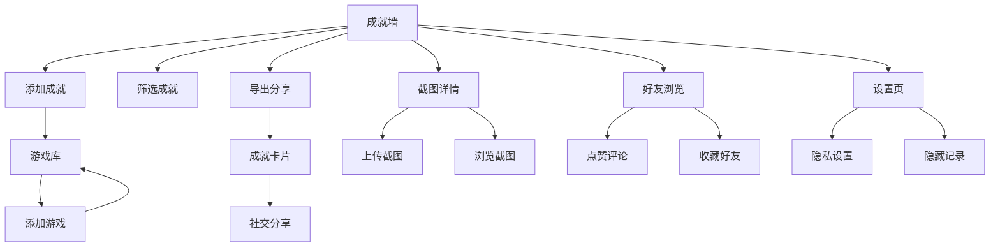

# 游戏成就展示小程序 - 产品需求文档

## 1. 产品概述

面向主机、PC 和手游玩家打造的个人成就展示与社交平台。用户可创建游戏档案、录入成就、上传精彩截图、与其他玩家互动，打造专属的游戏高光时刻集锦。

核心价值：为硬核玩家提供一个展示技术实力、分享游戏心得、记录成长轨迹的沉浸式空间，让每一次游戏成就都能被永久珍藏与分享。

## 2. 功能模块

### 2.1 核心页面结构

| 页面名称 | 功能定位 | 核心模块 |
|---------|---------|---------|
| 成就墙 | 展示所有成就的主页面 | 时间线视图、成就卡片、筛选排序 |
| 游戏库 | 管理游戏档案 | 游戏列表、添加游戏、平台筛选 |
| 截图详情 | 媒体浏览与管理 | 图片预览、视频播放、元数据展示 |
| 好友浏览 | 社交互动中心 | 好友动态、点赞评论、收藏管理 |
| 设置页 | 个人偏好配置 | 隐私设置、导出选项、主题切换 |

### 2.2 功能详情

#### 成就墙
- **成就卡片展示**：展示成就图标、名称、完成时间、稀有度标签
- **时间线视图**：按年份/月份查看成就完成轨迹
- **筛选排序**：按平台、稀有度、游戏、是否置顶筛选
- **置顶功能**：置顶代表作成就，突出显示在顶部
- **成就详情**：点击查看成就详情，包括心得笔记和关联截图

#### 游戏库
- **游戏档案管理**：添加/编辑/删除游戏信息
- **平台分类**：支持主机(PS/Xbox/Switch)、PC、手游四大平台
- **游戏封面**：上传游戏封面图
- **成就统计**：显示游戏内成就完成进度

#### 截图详情
- **媒体上传**：支持上传截图和短视频
- **媒体预览**：大图预览、视频播放
- **元数据**：关联成就、添加描述、设置可见性
- **时间线**：按时间顺序浏览所有媒体

#### 好友浏览
- **好友动态**：浏览好友的最新成就和分享
- **互动功能**：点赞、留言评论
- **收藏好友**：收藏好友的展示页面，方便快速访问
- **个人主页**：查看好友的完整成就墙

#### 设置页
- **隐私控制**：设置哪些成就/游戏对他人可见
- **隐藏记录**：隐藏不想公开的成就和媒体
- **导出功能**：生成适合社交平台分享的长图卡片
- **主题切换**：深色/浅色主题切换
- **数据管理**：导入/导出个人数据

### 2.3 用户角色

| 角色 | 权限范围 | 说明 |
|-----|---------|------|
| 访客 | 浏览公开内容 | 可查看他人公开的成就展示 |
| 注册用户 | 完整功能 | 可创建档案、上传内容、互动社交 |

## 3. 用户流程

### 3.1 添加游戏与成就流程

```
用户进入游戏库 → 点击添加游戏 → 填写游戏信息(名称、平台、封面)
→ 保存游戏档案 → 进入游戏详情 → 添加成就记录
→ 填写成就信息(名称、时间、稀有度、截图) → 保存成就
```

### 3.2 浏览与互动流程

```
进入好友浏览 → 发现好友动态 → 查看好友成就详情
→ 给好友点赞 → 发表评论 → 可选择收藏好友页面
```

### 3.3 导出分享流程

```
进入成就墙 → 选择要导出的成就 → 点击导出按钮
→ 生成成就卡片长图 → 下载/直接分享到社交平台
```

### 3.4 流程图



## 4. 界面设计

### 4.1 设计风格

**设计理念**：赛博朋克与游戏机舱融合

- **主色调**：深邃的暗紫色 (#1a1a2e) 作为基底
- **强调色**：霓虹青色 (#00fff5) 和电光紫 (#9d4edd) 作为点缀
- **辅助色**：银灰色 (#c0c0c0) 用于文字和边框
- **渐变**：紫-青渐变营造科技感氛围

**字体选择**：
- 标题：Orbitron (Google Fonts) - 科技感强
- 正文：Noto Sans SC - 中文支持良好

**按钮风格**：
- 霓虹发光边框按钮
- 悬停时产生光晕效果
- 圆角矩形，4px 圆角

**布局风格**：
- 卡片式布局，带有微妙的玻璃拟态效果
- 顶部固定导航栏，深色半透明背景
- 左侧边栏用于主要导航（大屏）/ 底部导航栏（小屏）

**图标风格**：
- 使用 Lucide Icons
- 统一使用线性图标风格，2px 描边

### 4.2 页面模块设计

#### 成就墙页面
| 模块名称 | 视觉风格 | 动效描述 |
|---------|---------|---------|
| 顶部导航 | 深色毛玻璃背景 | - |
| 年份选择器 | 水平滚动的年份标签 | 选中标签下划线动画 |
| 成就卡片网格 | 3列布局(桌面) / 2列(平板) / 1列(手机) | 卡片入场时从下方淡入上浮 |
| 稀有度标签 | 不同颜色徽章(传说/史诗/稀有/普通) | 悬停时微微发光 |
| 置顶标记 | 特殊金色边框 | 持续微微脉冲动画 |
| 空状态 | 中心显示添加成就引导 | - |

#### 游戏库页面
| 模块名称 | 视觉风格 | 动效描述 |
|---------|---------|---------|
| 平台标签筛选 | 胶囊按钮组 | 选中态填充高亮 |
| 游戏卡片 | 封面图+游戏名+成就数 | 悬停时卡片微微上浮 |
| 添加游戏按钮 | 虚线边框+加号图标 | 悬停时边框实线化 |
| 游戏详情弹窗 | 全屏模态框 | 从底部滑入 |

#### 截图详情页面
| 模块名称 | 视觉风格 | 动效描述 |
|---------|---------|---------|
| 媒体网格 | 瀑布流布局 | 图片懒加载动画 |
| 图片预览 | 全屏暗色背景 | 图片从点击位置放大展开 |
| 视频播放器 | 自定义播放器皮肤 | 进度条霓虹发光 |
| 关联成就标签 | 小型徽章 | - |

#### 好友浏览页面
| 模块名称 | 视觉风格 | 动效描述 |
|---------|---------|---------|
| 好友动态卡片 | 头像+动态内容+时间 | 新动态入场动画 |
| 点赞按钮 | 心形图标 | 点击时爆发动画 |
| 评论输入框 | 底部固定输入栏 | 输入时微微上浮 |
| 收藏标记 | 星形图标 | 已收藏状态金色填充 |

#### 设置页面
| 模块名称 | 视觉风格 | 动效描述 |
|---------|---------|---------|
| 设置分组卡片 | 毛玻璃卡片 | - |
| 开关控件 | 霓虹风格开关 | 切换时滑动动画 |
| 导出预览区 | 模拟社交卡片效果 | 实时预览导出样式 |
| 主题切换 | 日/月图标 | 点击时旋转切换动画 |

### 4.3 响应式策略

- **桌面 (≥1200px)**：三栏布局，左侧导航+中间内容+右侧辅助面板
- **平板 (768px-1199px)**：两栏布局，顶部导航+主内容区
- **手机 (<768px)**：单栏布局，底部 Tab 导航+全屏内容

### 4.4 3D 场景指导

本项目为纯 2D 界面，无需 3D 场景。

## 5. 技术实现要点

### 5.1 数据存储

使用 localStorage 存储用户数据，采用 JSON 结构：
- 用户档案
- 游戏列表
- 成就记录
- 截图/视频引用
- 好友关系
- 设置偏好

### 5.2 导出功能

使用 html2canvas 库将选中的成就区域导出为 PNG 图片，包含：
- 用户昵称
- 成就展示卡片
- 统计数据
- 小程序水印

### 5.3 媒体处理

- 图片使用 FileReader API 预览
- 视频使用原生 video 标签播放
- 使用 URL.createObjectURL 生成预览地址
