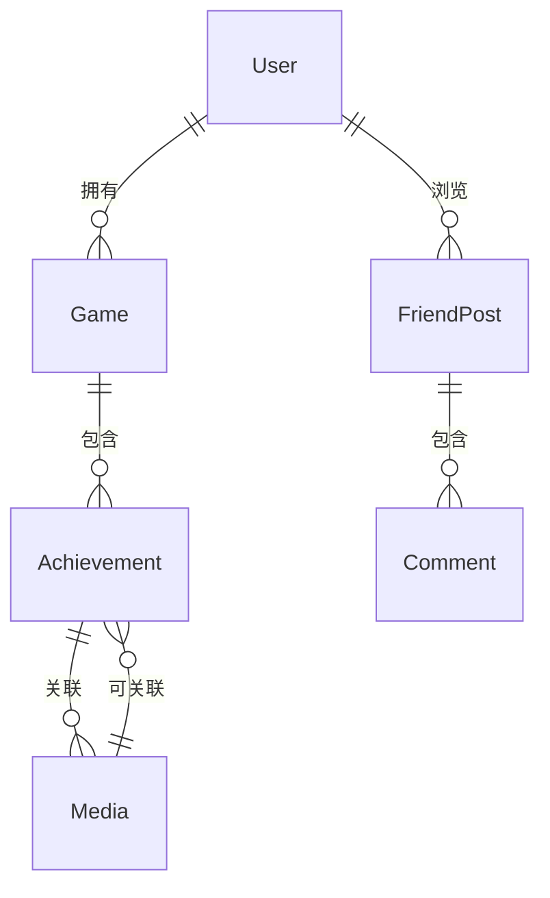

# 游戏成就展示小程序 - 技术架构文档

## 1. 架构设计

```
┌─────────────────────────────────────────────────────────┐
│                     前端应用层                           │
│  React 18 + TypeScript + Tailwind CSS + Lucide Icons   │
├─────────────────────────────────────────────────────────┤
│                     状态管理层                           │
│              React Context + useReducer                  │
├─────────────────────────────────────────────────────────┤
│                     数据存储层                           │
│            localStorage (JSON 数据持久化)                 │
├─────────────────────────────────────────────────────────┤
│                     工具库层                             │
│     html2canvas (导出) + date-fns (日期处理)            │
└─────────────────────────────────────────────────────────┘
```

## 2. 技术栈说明

### 2.1 核心框架
- **React 18**: 组件化开发，用户界面构建
- **TypeScript**: 类型安全，提高代码质量
- **Vite**: 快速构建工具，开发服务器

### 2.2 样式方案
- **Tailwind CSS 3**: 原子化 CSS，快速样式开发
- **CSS Variables**: 自定义主题变量
- **CSS Animations**: 页面过渡和微交互动效

### 2.3 依赖库
- **lucide-react**: 图标库
- **html2canvas**: 将 DOM 导出为 Canvas 图片
- **date-fns**: 日期处理和格式化

### 2.4 数据存储
- **localStorage**: 浏览器本地存储
  - 用户档案数据
  - 游戏列表
  - 成就记录
  - 截图/视频引用(base64)
  - 好友数据(模拟)
  - 应用设置

## 3. 路由定义

| 路由路径 | 页面组件 | 功能描述 |
|---------|---------|---------|
| / | AchievementWall | 成就墙主页，展示所有成就 |
| /games | GameLibrary | 游戏库，管理游戏档案 |
| /media | MediaGallery | 截图详情，浏览媒体文件 |
| /friends | FriendBrowse | 好友浏览，社交互动 |
| /settings | Settings | 设置页面 |

## 4. 数据模型

### 4.1 数据结构

```typescript
// 用户档案
interface UserProfile {
  id: string;
  nickname: string;
  avatar: string; // base64 或 URL
  bio: string;
  joinedDate: string;
}

// 游戏档案
interface Game {
  id: string;
  name: string;
  platform: 'ps' | 'xbox' | 'switch' | 'pc' | 'mobile';
  coverImage: string; // base64 或 URL
  achievements: Achievement[];
  createdAt: string;
}

// 成就记录
interface Achievement {
  id: string;
  gameId: string;
  name: string;
  description?: string;
  completedAt: string;
  rarity: 'legendary' | 'epic' | 'rare' | 'common';
  isPinned: boolean;
  isPublic: boolean;
  media: Media[]; // 关联的截图/视频
  notes?: string; // 心得笔记
}

// 媒体文件
interface Media {
  id: string;
  type: 'image' | 'video';
  url: string; // base64 或 URL
  thumbnail?: string;
  createdAt: string;
  relatedAchievementId?: string;
}

// 好友动态
interface FriendPost {
  id: string;
  friendId: string;
  friendName: string;
  friendAvatar: string;
  content: Achievement | Media;
  contentType: 'achievement' | 'media';
  likes: number;
  isLiked: boolean;
  comments: Comment[];
  createdAt: string;
}

// 评论
interface Comment {
  id: string;
  author: string;
  avatar: string;
  text: string;
  createdAt: string;
}

// 应用设置
interface AppSettings {
  theme: 'dark' | 'light';
  defaultPlatform: string;
  defaultRarity: string;
  exportIncludeStats: boolean;
}
```

### 4.2 数据关系图



## 5. 组件结构

```
src/
├── components/
│   ├── Layout/
│   │   ├── Sidebar.tsx       # 侧边导航
│   │   ├── BottomNav.tsx     # 底部导航(移动端)
│   │   └── TopNav.tsx        # 顶部导航栏
│   ├── Achievement/
│   │   ├── AchievementCard.tsx
│   │   ├── AchievementModal.tsx
│   │   ├── AchievementForm.tsx
│   │   └── RarityBadge.tsx
│   ├── Game/
│   │   ├── GameCard.tsx
│   │   ├── GameModal.tsx
│   │   ├── GameForm.tsx
│   │   └── PlatformFilter.tsx
│   ├── Media/
│   │   ├── MediaGrid.tsx
│   │   ├── MediaPreview.tsx
│   │   └── MediaUploader.tsx
│   ├── Friend/
│   │   ├── FriendCard.tsx
│   │   ├── CommentSection.tsx
│   │   └── LikeButton.tsx
│   ├── Export/
│   │   └── ExportPreview.tsx
│   └── Common/
│       ├── Button.tsx
│       ├── Modal.tsx
│       ├── Input.tsx
│       └── Select.tsx
├── pages/
│   ├── AchievementWall.tsx
│   ├── GameLibrary.tsx
│   ├── MediaGallery.tsx
│   ├── FriendBrowse.tsx
│   └── Settings.tsx
├── context/
│   ├── AppContext.tsx        # 全局状态
│   └── ThemeContext.tsx      # 主题状态
├── hooks/
│   ├── useLocalStorage.ts    # localStorage hook
│   └── useExport.ts          # 导出功能 hook
├── utils/
│   ├── storage.ts            # 存储工具
│   ├── dateUtils.ts          # 日期处理
│   └── exportUtils.ts        # 导出工具
├── data/
│   └── mockData.ts           # 模拟数据
└── types/
    └── index.ts              # 类型定义
```

## 6. 核心功能实现

### 6.1 数据持久化
使用 localStorage + React Context 实现数据管理：
- 初始化时从 localStorage 读取数据
- 数据变更时自动保存到 localStorage
- 提供加载、保存、重置数据的工具函数

### 6.2 导出长图功能
使用 html2canvas 实现：
1. 用户选择要导出的成就范围
2. 创建临时 DOM 容器渲染导出内容
3. 使用 html2canvas 将 DOM 转为 Canvas
4. Canvas 导出为 PNG 图片
5. 触发浏览器下载

### 6.3 媒体处理
- 图片使用 FileReader API 转为 base64
- 视频使用 URL.createObjectURL 生成预览地址
- 提供图片压缩和缩略图生成

### 6.4 筛选与排序
- 按平台筛选游戏列表
- 按稀有度、日期、是否置顶筛选成就
- 支持升序/降序排序

## 7. 样式架构

### 7.1 CSS 变量

```css
:root {
  /* 颜色系统 */
  --color-bg-primary: #1a1a2e;
  --color-bg-secondary: #16213e;
  --color-bg-card: rgba(30, 30, 50, 0.8);
  --color-accent-cyan: #00fff5;
  --color-accent-purple: #9d4edd;
  --color-accent-gold: #ffd700;
  --color-text-primary: #ffffff;
  --color-text-secondary: #a0a0a0;
  
  /* 稀有度颜色 */
  --rarity-legendary: linear-gradient(135deg, #ffd700, #ff8c00);
  --rarity-epic: linear-gradient(135deg, #9d4edd, #7b2cbf);
  --rarity-rare: linear-gradient(135deg, #00fff5, #00b4d8);
  --rarity-common: linear-gradient(135deg, #6c757d, #495057);
  
  /* 间距系统 */
  --spacing-xs: 0.25rem;
  --spacing-sm: 0.5rem;
  --spacing-md: 1rem;
  --spacing-lg: 1.5rem;
  --spacing-xl: 2rem;
  
  /* 圆角 */
  --radius-sm: 4px;
  --radius-md: 8px;
  --radius-lg: 12px;
  
  /* 阴影 */
  --shadow-card: 0 4px 20px rgba(0, 0, 0, 0.3);
  --shadow-glow: 0 0 20px rgba(0, 255, 245, 0.3);
}
```

### 7.2 动画效果
- 页面切换：淡入淡出 + 轻微上浮
- 卡片悬停：微微上浮 + 边框发光
- 按钮点击：轻微缩放反馈
- 数据加载：骨架屏 + 渐入动画

## 8. 性能优化

- 使用 React.memo 优化组件渲染
- 图片懒加载，减少初始加载时间
- 使用虚拟列表优化长列表渲染
- 防抖处理筛选搜索操作
- localStorage 操作加异常处理
